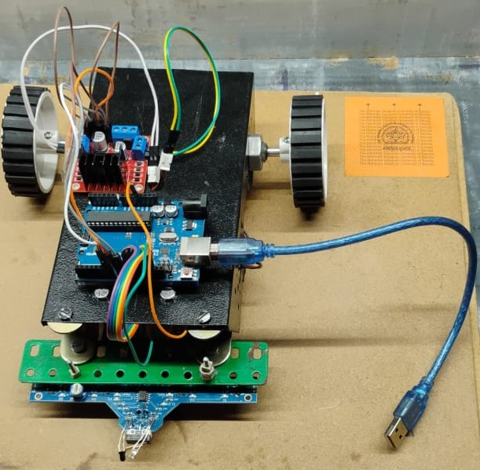
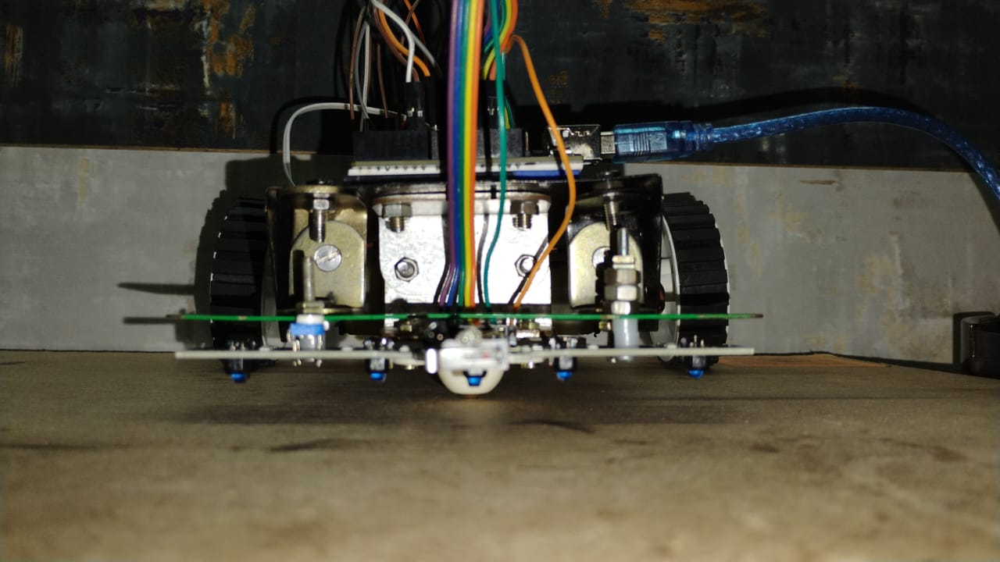
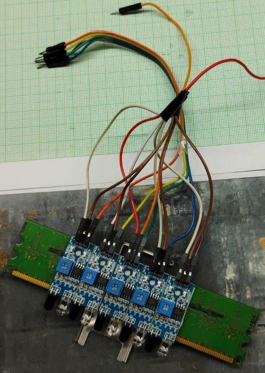
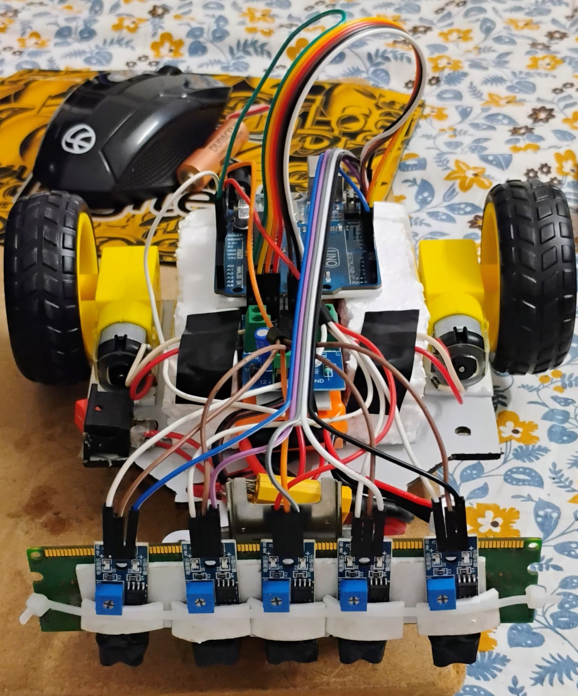
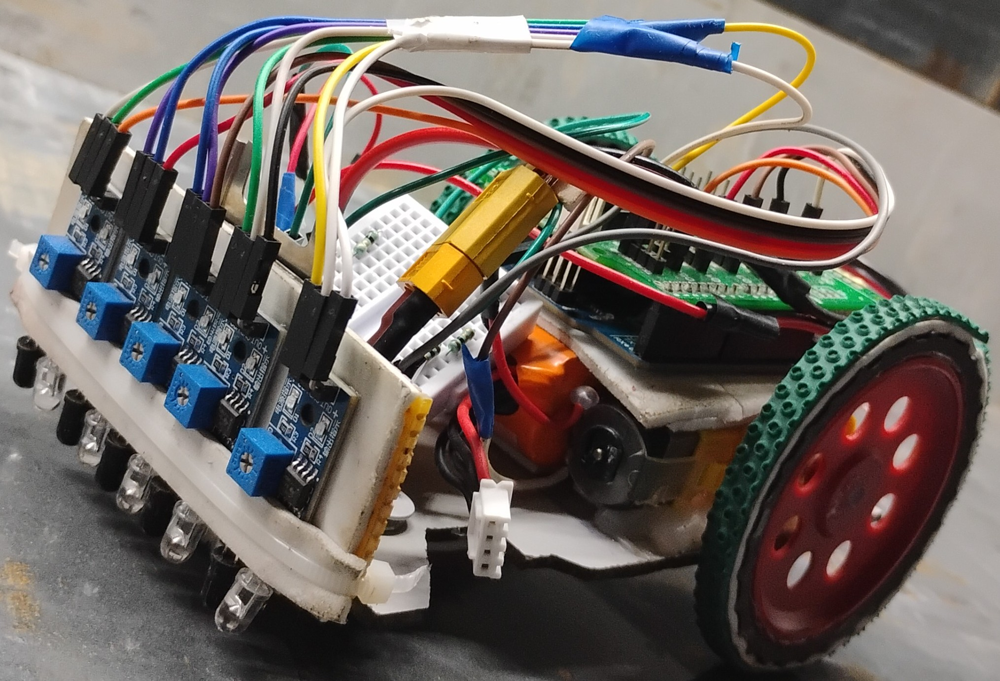
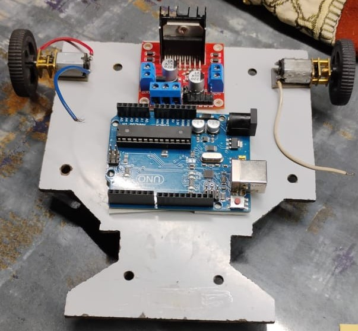

[← Main Repository](../README.md) | [Next → Year 2](Year2.md)

# Advanced Line Following Robot (LFR)

**A High‑Performance, Memory‑Enabled, Path‑Optimizing Line Following Robot**

**Platform :** Teensy 4.1, Arduino Nano, Arduino UNO

**Category :** Robotics / Embedded Systems / Autonomous Navigation

---

# Abstract

This document is a **chronological engineering journey** spanning three academic years, documenting the evolution of my understanding, design philosophy, failures, corrections, and breakthroughs while building Line Following Robots (LFRs).

What began as a simple beginner-friendly robot that merely followed a line gradually transformed into a **high-performance, memory-enabled, path-optimizing autonomous system**. Each iteration reflects deliberate design decisions, mistakes encountered, limitations discovered, and solutions engineered.

---

# Introduction — Why a Line Follower?

A line following robot is often considered one of the simplest entry points into robotics. It uses sensors to detect a line and motors to follow it. Straightforward. Predictable. Almost trivial.

But this simplicity raises an important question:

> If a robot only reacts to a line in front of it, is it truly intelligent?
> 

In its most basic form, a line follower demonstrates motion — not understanding. It reacts but does not remember, adapts but does not learn, moves fast but does not think.

This documentation dives deep into my **three-year journey with line following robots**, starting from a basic beginner build in Year 1, progressing through iterative refinements in Year 2, and culminating in an advanced maze-solving, memory-driven LFR in Year 3.

---

# YEAR 1 - The stepping stones in Automation

# 1.1.1 Initial Prototype — Basic Starter Kit

>Develop the first functional line-following robot using readily available components.
>

### System Configuration

- Microcontroller: Arduino UNO
- Power Source: Power Bank
- Drive System: Metal Chassis + 2 DC motors + castor wheel
- Sensors: Low-cost local market sensor array
- Motor Interface: Basic Motor Driver Shield

  
  

### Initial Control Logic

- Left sensor on line, turn left
- Right sensor on line, turn right

### Observations

- Robot moved in a zigzag trajectory
- Motion speed was very low
- Direction correction was inconsistent
- Robot could only operate under simple track conditions

### Engineering Remark

At this stage, the robot operated purely using reactive conditional logic without structured understanding of track geometry or motion dynamics.

### Result

A functional proof-of-concept line follower was successfully developed, establishing the foundation for future hardware and control improvements.

---

# 1.1.2 Sensor Expansion & Mechanical Calibration Prototype

>Improve line detection stability and turning capability through better sensors, mechanical calibration, and refined hardware integration.
>

### System Configuration

- Microcontroller: Arduino UNO
- Power Source: Li-Po Battery
- Drive System: Plywood Chassis + 2 BO motors + castor wheel
- Sensors: 5 Single IR Sensor Array
- Motor Interface: L293D Motor Driver
- Additionally an adjustable slider mechanism was also used to set the detection range of sensors manually.

  
  
  

---

🎥[Prototype Run](https://youtube.com/shorts/G9jCbpRqdrw?feature=share)  

---

### Initial Control Logic

- Left sensor on line, turn left
- Right sensor on line, turn right
- Center Sensor on line, ensures robot on track
- Outer two sensors aided in detecting 90 degree right and left turns

### Observations

- Robot moved in a zigzag trajectory, but showed improvement in oscillations by using the center sensor.
- Motion speed was improved because of faster response from individual sensors and accurate BO Motors.
- Direction correction improved but still inconsistent.
- Robot could only operate under simple track conditions.

### Engineering Remark

At this stage, the system hardware was refined through the integration of higher-quality sensing and drive components, resulting in noticeable improvements in tracking stability and motion response.

### Result

The second iteration demonstrated measurable improvements in sensing reliability, directional correction, and motion responsiveness, validating the importance of sensor placement and component quality in line-following performance.

---

# 1.1.3 Precision Drive System Upgrade

>Improve motion precision, response consistency, and control stability through upgraded drive motors and enhanced motor driving circuitry.
>

### System Configuration

- Microcontroller: Arduino UNO
- Power Source: Custom Li-Ion Battery
- Drive System: Plywood Chassis + 2 N20 micro geared motors + castor wheel
- Sensors: 5 Single IR Sensor Array
- Motor Interface: L298N Motor Driver
- Improved chassis balancing and motor mounting alignment were also implemented to reduce mechanical play during motion.

  

---

🎥[Slow Motion Video Demonstration](https://youtu.be/9cnTpXSCFiw)  
🎥[Watch Competition Video at ITM Illuminati 2024](https://youtu.be/2ZwEChPN6mk)  
🎥[Watch Competition Preparation Video for Ahmedabad University Ingenium 2024](https://youtu.be/NP2wJxn7rvI)  

---

### Initial Control Logic

- Left sensor on line, turn left
- Right sensor on line, turn right
- Center Sensor on line, ensures robot on track
- Outer two sensors aided in detecting 90 degree right and left turns
- Turning response thresholds were further refined for smoother directional correction

### Observations

- Robot motion became significantly smoother due to reduced mechanical play in N20 geared motors
- Higher torque and improved gear precision increased motion stability
- Speed improved noticeably while maintaining better directional control
- Turning response became more accurate because of refined motor behavior and improved control logic
- Sharp turns were handled more consistently compared to previous iterations

### Engineering Remark

At this stage, the focus shifted toward improving motion precision and drivetrain reliability. The integration of N20 geared motors and a more capable motor driver significantly enhanced the robot’s responsiveness, stability, and turning consistency.

### Result

The upgraded drive system demonstrated substantial improvements in speed, motion smoothness, and directional accuracy, highlighting the importance of precise motor control and mechanical stability in line-following performance.

---
# Conclusion

>Although significant improvements were achieved through hardware refinement and expanded sensing capabilities, the robot still relied heavily on reactive correction methods. Increasing speed further resulted in instability, oscillations, and inconsistent trajectory control. These limitations motivated the exploration of closed-loop feedback systems and ultimately led to the adoption of PID-based motion control during the intermediate development phase.
>

---
