[← Year 2](Year2.md) | [Main Repository](../README.md)

# ADVANCED DEVELOPMENT PHASE

Runtime Configurability, Memory Systems & Autonomous Intelligence

---

# YEAR 3 — Advanced Optimization & Intelligent Robotics

---

# 3.1.1 Multi-Profile PID Control System with Embedded User Interface

>Develop a high-performance configurable line-following platform capable of real-time PID tuning, persistent parameter storage, and advanced sensor calibration through an onboard embedded interface system.
>
---

### System Configuration

- Microcontroller: Teensy 4.1
- Power Source: Custom Li-Po Battery Pack
- Drive System: High-speed chassis + precision N20 micro geared motors
- Sensors: 16 custom-shaped QRE1113 sensor array
- Motor Interface: TB6612FNG Motor Driver
- Development Platform: Custom Teensy 4.1 zero-board prototype
- User Interface: Onboard OLED display and tactile button-controlled navigation system
- Power Architecture: Integrated onboard voltage regulation system for stable multi-voltage power distribution without external buck converters

  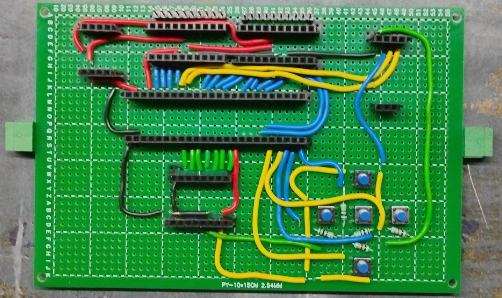
  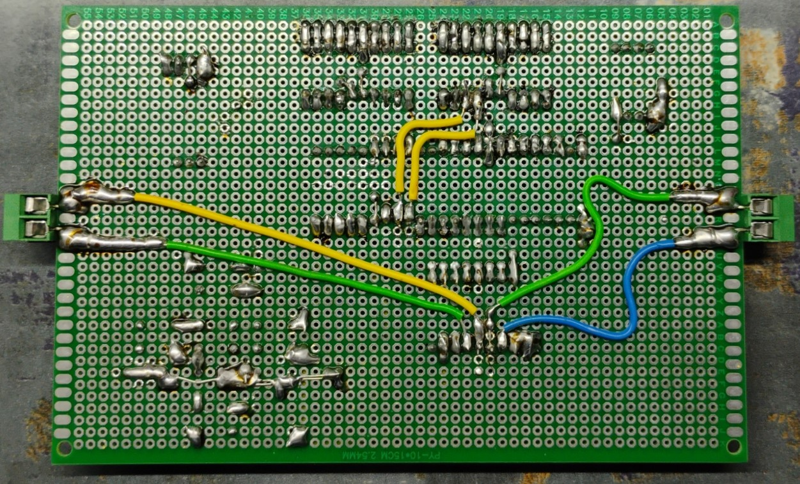
  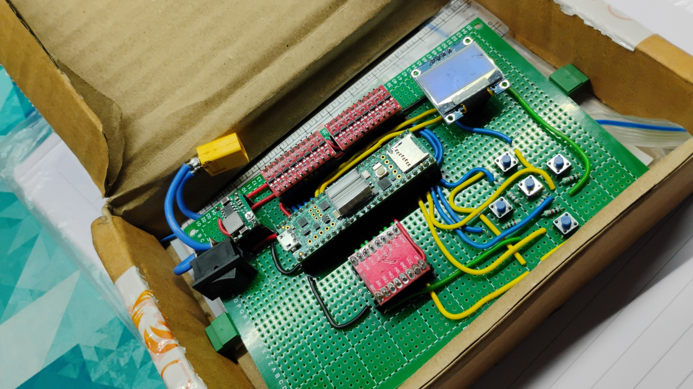
  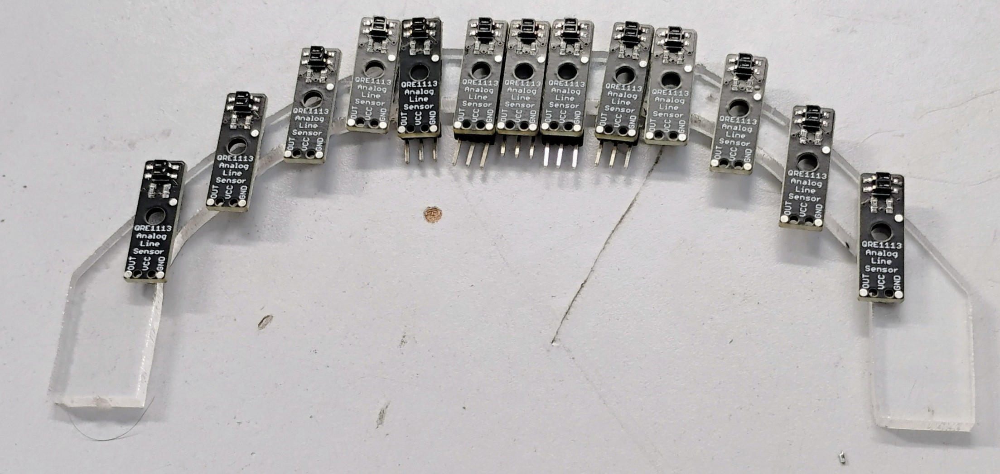
  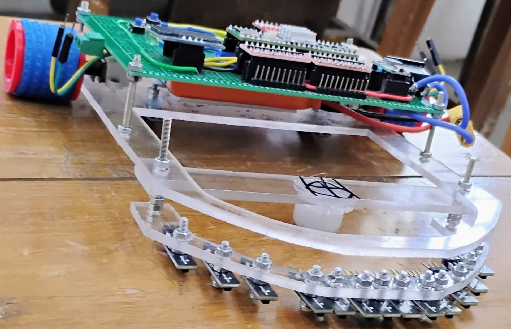

---

### 🎥[New Robot Design CAD Designing](https://youtu.be/8GJ0qbsseVE)  
### 🎥[FULL On-board UI Designing](https://youtu.be/5oN1zwH2pbs)  

---

### Initial Control Logic

- A menu-driven embedded interface was developed to enable real-time interaction with robot control parameters
- On startup, the system first entered sensor calibration mode before execution of operational code profiles
- Multiple PID configuration profiles were supported simultaneously through an onboard code-selection interface
- Five independent PID tuning profiles were implemented and selectable through tactile button navigation
- Each profile allowed tuning of:
    - Proportional Gain (Kp)
    - Derivative Gain (Kd)
    - Integral Gain (Ki)
- After parameter tuning, the selected profile could directly execute the robot using the configured control constants
- PID constants and calibration data were stored persistently using the EEPROM memory of the Teensy 4.1
- Sensor threshold arrays generated during calibration were also stored in EEPROM, eliminating the need for recalibration during every startup cycle

### Observations

- The Teensy 4.1 provided significantly higher computational capability and execution speed compared to previous Arduino-based systems
- The 16-sensor QRE1113 array enabled extremely high positional resolution and improved error detection precision during high-speed navigation
- The custom sensor geometry improved line acquisition consistency and transition smoothness across complex track sections
- The onboard user interface dramatically simplified PID tuning and testing workflows during experimentation
- Storing multiple PID profiles enabled rapid switching between different control strategies without recompilation of firmware
- EEPROM-based parameter storage improved usability and reduced repetitive setup procedures during testing sessions
- Integrated onboard voltage regulation provided cleaner and more reliable power delivery compared to bulky external buck converter modules
- Real-time parameter tuning significantly accelerated experimentation and optimization cycles during robot development

### Engineering Remark

This stage marked a major evolution from fixed-function robotics systems toward configurable embedded control architectures. Instead of relying on hardcoded PID parameters and repeated firmware uploads, the robot evolved into an interactive autonomous platform capable of runtime configuration, persistent memory storage, and adaptive tuning workflows. The integration of EEPROM-based profile management, onboard calibration systems, and embedded user interfaces significantly improved development efficiency, scalability, and system intelligence.

### Result

The first Year 3 iteration transformed the robot into a highly configurable high-speed embedded robotics platform with persistent memory capabilities, runtime PID tuning, and advanced sensing precision. The integration of a multi-profile control architecture, EEPROM-based parameter management, and onboard interface systems established the foundation for future memory-enabled navigation, path optimization, and intelligent autonomous behavior.

---

# 3.1.2 Embedded System Reliability Refinement & Algorithm Prototyping

>Improve long-term operational reliability of the embedded control system while simultaneously developing and validating shortest-path navigation algorithms for future autonomous maze-solving implementation.
>
### System Configuration

- Microcontroller: Teensy 4.1
- Power Source: Custom Li-Po Battery Pack
- Drive System: High-speed chassis + precision N20 micro geared motors
- Sensors: 16 custom-shaped QRE1113 sensor array
- Motor Interface: TB6612FNG Motor Driver
- Development Platform: Re-prototyped custom Teensy 4.1 carrier PCB
- User Interface: OLED-based interactive menu system with sensor-based navigation controls
- Memory System: EEPROM-based persistent storage for PID profiles and calibration parameters

  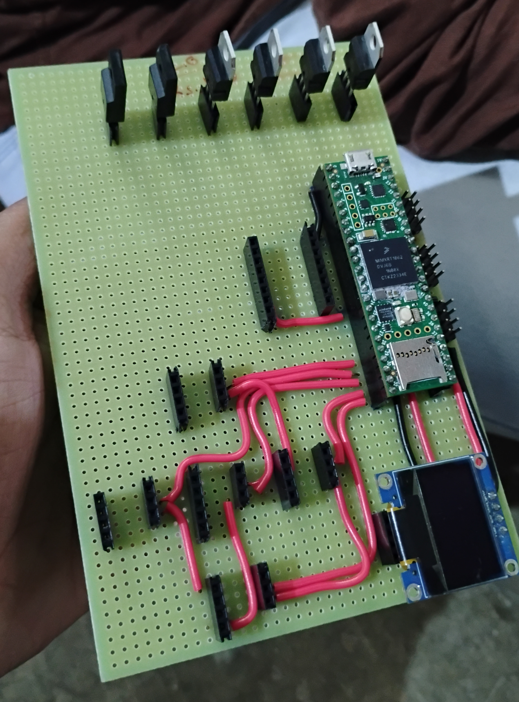
  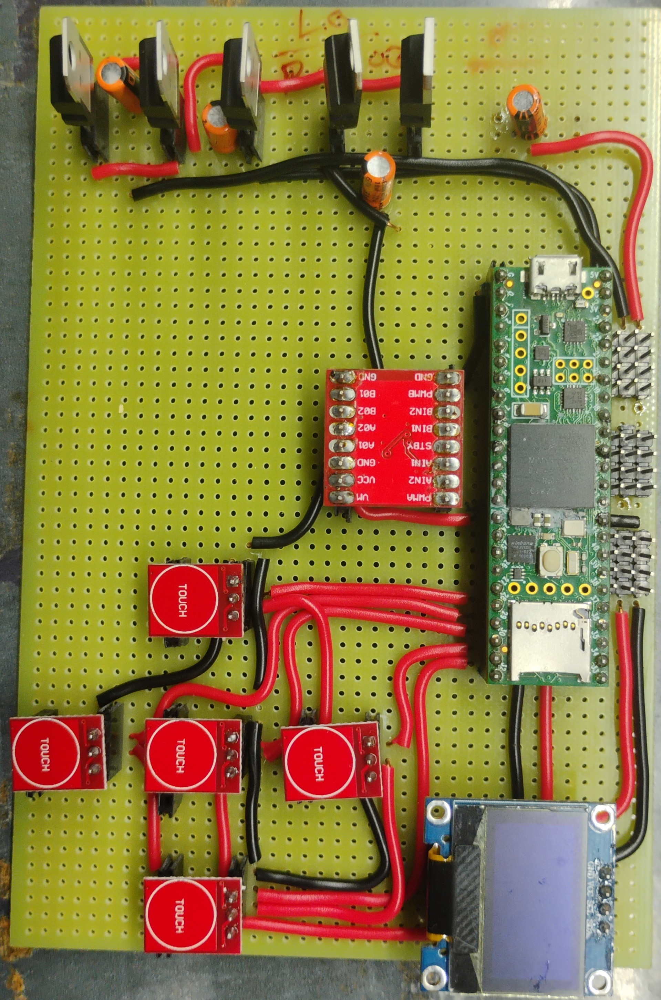
  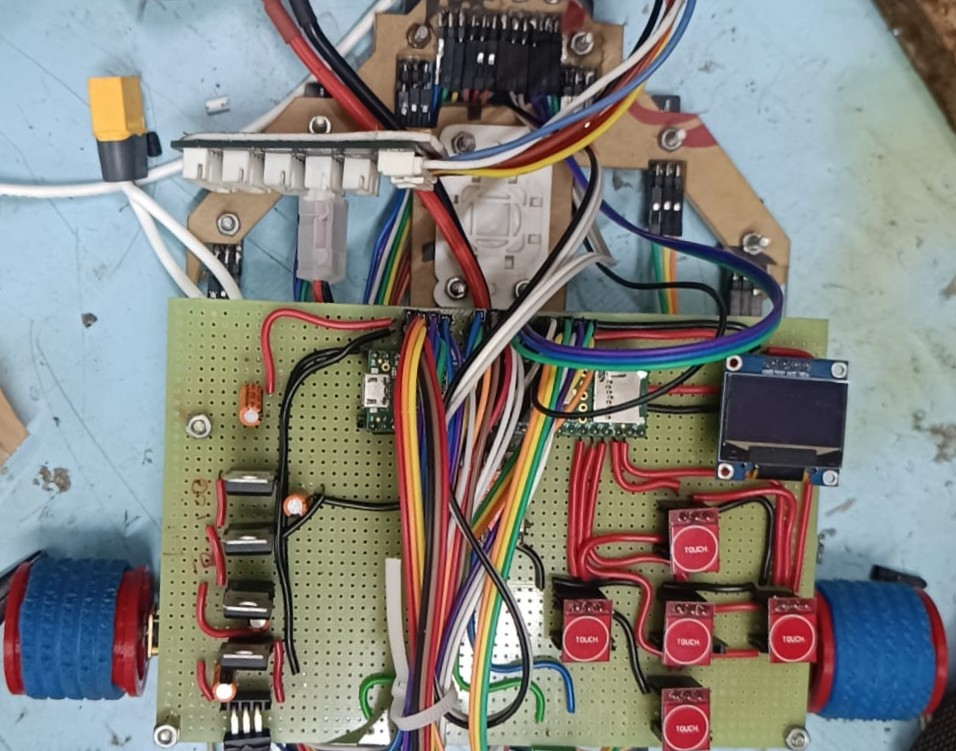

---

### Initial Control Logic

- Runtime PID tuning architecture from the previous iteration was retained
- Multiple PID profiles continued to support independent tuning and execution modes
- Calibration thresholds and PID constants were persistently stored in EEPROM memory
- Mechanical tactile buttons were replaced with sensor-based interface controls to eliminate reliability issues caused by switch fatigue and debounce instability
- Parallel development of shortest-path solving algorithms was initiated using standalone C-based software prototypes before embedded deployment
- Complex track structures and path optimization logic were manually analyzed and validated through software simulation prior to robot implementation

### Observations

- Mechanical tactile buttons exhibited long-term reliability issues due to fatigue and rapid unintended triggering caused by low debounce intervals
- Sensor-based interface navigation significantly improved interaction reliability and eliminated mechanical wear-related failures
- Re-prototyping the PCB improved overall integration quality but introduced substantial wiring complexity due to the large number of sensor interconnections
- High-density sensor wiring increased debugging complexity and reduced maintainability during hardware iteration cycles
- Developing the shortest-path algorithm separately in standard C significantly accelerated logic experimentation and debugging before hardware integration
- Manual path analysis and software prototyping improved understanding of path simplification and maze-solving logic
- Separating algorithm validation from embedded deployment reduced firmware debugging complexity during future integration stages

### Engineering Remark

This stage focused on improving embedded system robustness while transitioning from pure motion control toward intelligent navigation algorithm development. The replacement of mechanical interface components with sensor-based controls improved long-term reliability, while standalone algorithm prototyping established a structured software validation workflow prior to hardware deployment. This marked the beginning of the robot’s evolution from a high-speed line follower into an autonomous path-processing system.

---

  
  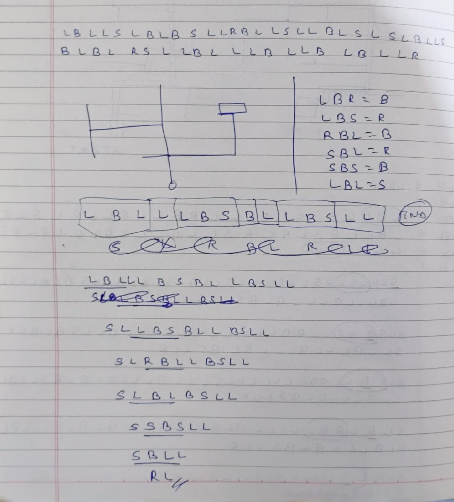
  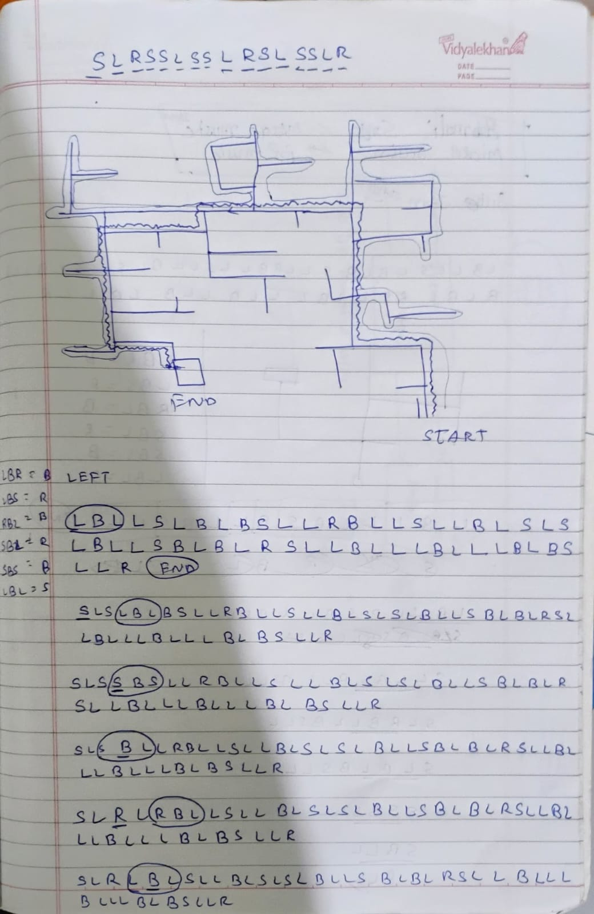
  
  

---

### Result

The second Year 3 iteration significantly improved system reliability, interface robustness, and algorithm development methodology. By introducing software-level shortest-path prototyping and improving embedded interaction reliability, the robot established the architectural foundation required for future autonomous maze-solving and path optimization capabilities.

---

# 3.1.3 Fully In-House Sensor Architecture & Autonomous Path Optimization

>Develop a fully modular and independently manufacturable robotics platform capable of robust autonomous navigation, adaptive sensor calibration, and shortest-path execution through custom-designed hardware and intelligent sensing systems.
>
### System Configuration

- Microcontroller: Teensy 4.1
- Power Source: Custom Li-Po Battery Pack
- Drive System: High-speed chassis + precision N20 micro geared motors
- Sensors: Custom-designed 10-channel analog IR sensor array using TCRT5000L sensors
- Motor Interface: TB6612FNG Motor Driver
- Development Platform: Custom-designed carrier module PCB and custom IR sensor array PCB
- User Interface: OLED-based runtime tuning and calibration interface with sensor-controlled navigation
- Memory System: EEPROM-based persistent storage for PID profiles, calibration thresholds, and navigation data
- Navigation System: Shortest-path storage and execution architecture

  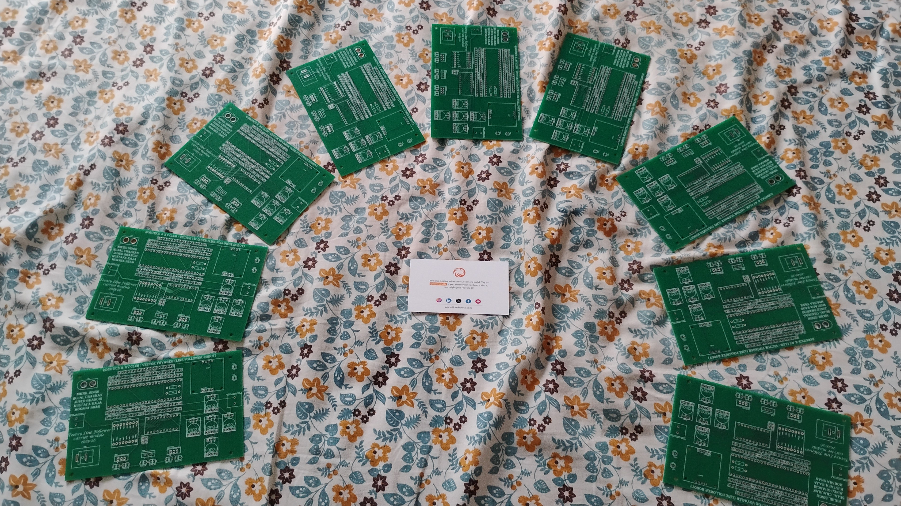
  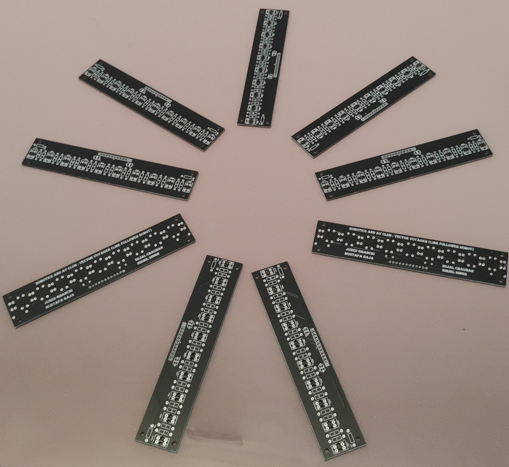
  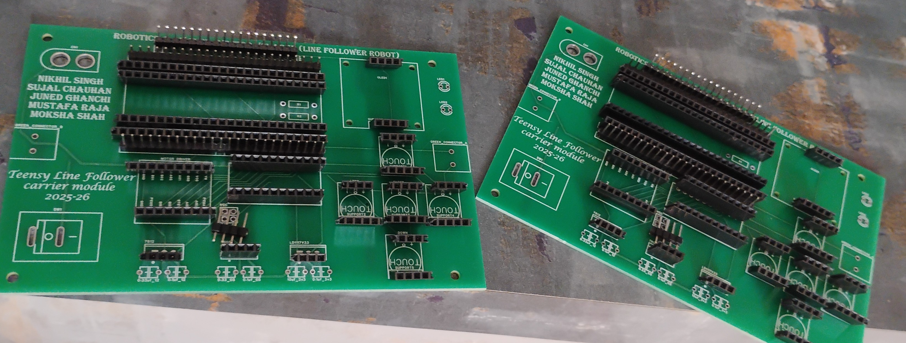
  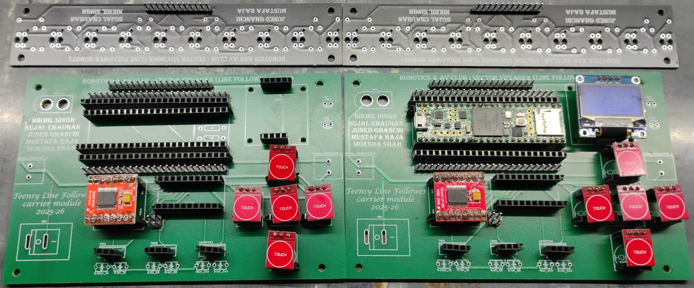
  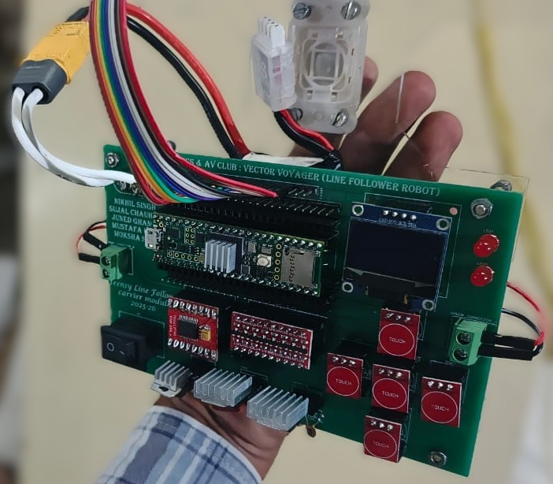
  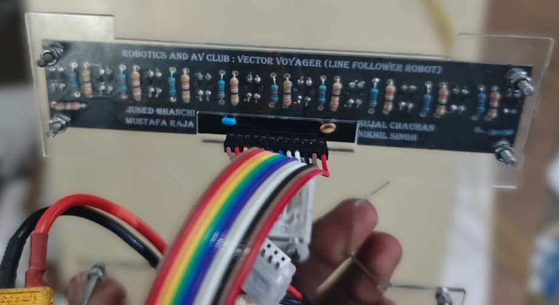
  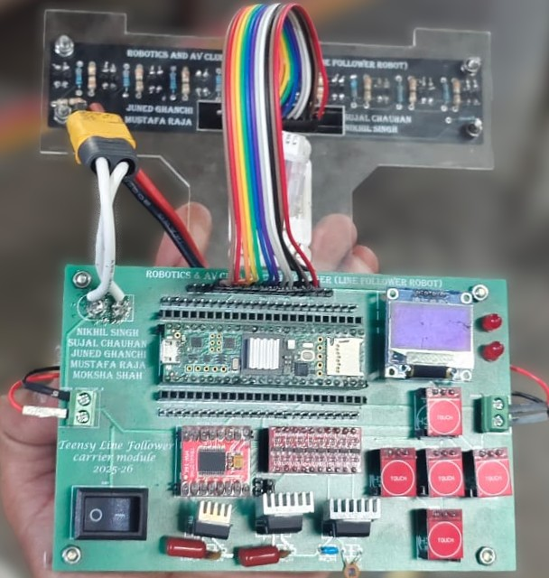

---

🎥[Full Robot Run using Inhouse parts](https://youtu.be/NfQx6Jn7YF0)  

---

### Initial Control Logic

- Real-time PID control continuously corrected robot trajectory using calibrated analog sensor readings
- ADC-based sensing logic converted analog sensor values into calibrated digital interpretations using dynamically generated threshold arrays
- Sensor calibration values and PID tuning parameters were persistently stored in EEPROM memory
- Raw navigation decisions and junction data were first recorded during exploration runs before path optimization processing
- Stored navigation data was processed using shortest-path simplification algorithms to generate optimized traversal sequences
- The robot subsequently executed the optimized path data array with high-speed autonomous navigation capability
- Sensor offset compensation logic was implemented to correct analog inconsistencies between individual sensing channels

### Observations

- QRE1113 sensors demonstrated extremely high positional precision but proved excessively sensitive to environmental variations such as surface texture, lighting conditions, and track material changes
- Competition environments required greater sensing robustness rather than maximum theoretical sensitivity
- A faulty replacement Smartelex sensor array further highlighted the limitations of dependence on commercial sensing modules
- Analysis of the Smartelex architecture revealed the use of comparator-based digital sensing between paired sensors along with pull-up resistor-based analog outputs
- Comparator-based digital outputs were found to be less reliable for precision PID applications due to sensitivity variations and potentiometer-based threshold inaccuracies
- ADC-based analog processing provided significantly greater precision and calibration flexibility compared to fixed comparator threshold systems
- Individual sensors exhibited analog offset variations even under identical surface conditions, requiring software-level compensation during PID error calculation
- The custom TCRT5000L-based sensor array provided improved robustness while maintaining high sensing precision suitable for competitive environments
- Designing both the carrier PCB and sensor array PCB internally significantly improved modularity, maintainability, and independence from commercial module availability
- Fully modular subsystem design enabled rapid replacement and low-cost hardware iteration during testing and competition preparation

### Advanced Sensor Optimization Strategy

To further improve sensing adaptability across varying track materials and environmental conditions, an adaptive IR illumination control system was introduced.

- IR emitter illumination intensity was designed to be dynamically controlled using MOSFET-based switching circuitry
- During calibration mode, the robot experimentally evaluates multiple illumination levels to determine the configuration producing the highest sensing resolution and analog range
- Once optimal illumination is identified, the robot generates sensor-specific threshold values corresponding to the selected operating condition
- This adaptive calibration architecture compensates for sensor variation, surface reflectivity differences, and environmental lighting inconsistencies
- The system enables the robot to dynamically optimize sensing performance for different competition environments without hardware modification

### Engineering Remark

This stage marked the complete transition from dependence on commercial robotics modules toward fully in-house robotics system engineering. By designing both the carrier PCB and the analog IR sensing architecture internally, the robot evolved into a highly modular, maintainable, and competition-oriented autonomous platform. Simultaneously, the implementation of shortest-path memory processing transformed the robot from a reactive navigation system into an intelligent autonomous agent capable of environmental interpretation, path optimization, and high-speed execution.

### Result

The final Year 3 iteration successfully integrated custom hardware manufacturing, adaptive sensing systems, EEPROM-based memory architecture, and shortest-path autonomous navigation into a unified robotics platform. The robot became fully capable of storing raw navigation data, processing optimized traversal paths, dynamically adapting sensing behavior to environmental conditions, and executing high-speed autonomous navigation with precision, robustness, and complete subsystem independence from commercial robotics modules.

---

  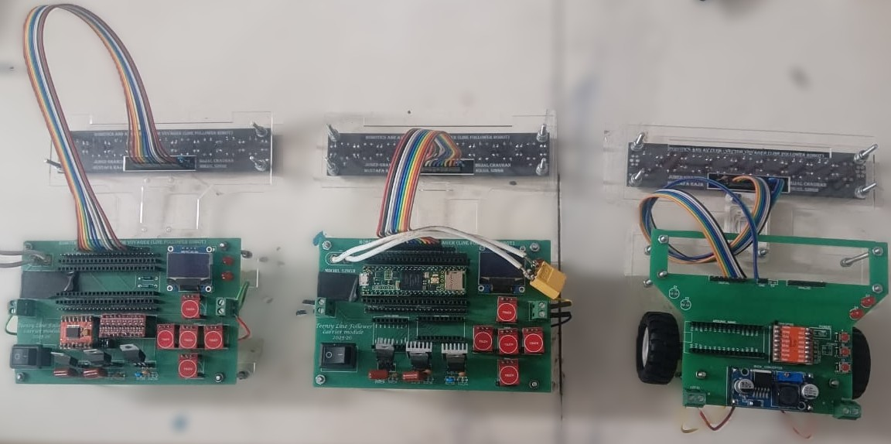

---
# Conclusion

>Over the course of three years, the project evolved from a simple reactive line-following robot into a highly integrated autonomous robotics platform capable of high-speed navigation, runtime configurability, adaptive sensing, persistent memory storage, and shortest-path optimization.
>
>The journey was not defined solely by successful outcomes, but by continuous experimentation, repeated failures, subsystem redesigns, and gradual understanding of how mechanical systems, embedded electronics, sensing architectures, and control algorithms interact as a unified robotic system.
>
>What initially began as a basic IF-ELSE line follower eventually expanded into multiple engineering domains including PID control systems, embedded firmware architecture, EEPROM-based memory management, PCB design, analog sensing systems, runtime interface development, autonomous navigation algorithms, and custom hardware manufacturing.
>
>By the final iteration, the robot had become a fully modular and independently manufacturable autonomous platform capable of:
>
>-High-speed PID-controlled navigation
>-Runtime parameter tuning through onboard interfaces
>-Adaptive sensor calibration and offset compensation
>-Persistent memory-based configuration storage
>-Shortest-path data processing and optimized path execution
>-In-house carrier PCB and sensor array development
>
>More importantly, the project transformed the understanding of robotics itself — from simply making a robot move to engineering complete autonomous systems that can sense, process, optimize, adapt, and execute decisions reliably under real-world constraints.
>
>This documentation therefore represents not only the development of a line-following robot, but the evolution of engineering thinking, systems-level problem solving, and autonomous robotics design philosophy developed throughout the journey.